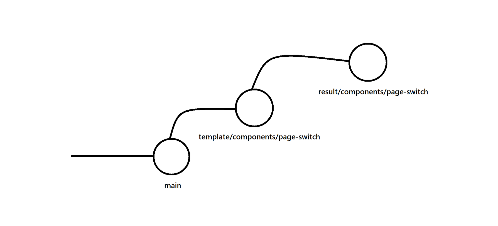

# Tech4GoodExamples

## Pre-requisites

In order for working on this repository you could either run this locally, or use Docker to run this.

I **HIGHLY** recommend using Docker as there are issues prone to occur on local machine.

Please download [Docker Desktop](https://www.docker.com/products/docker-desktop/), and have more than 5GB of space.

---

## Steps for Docker

Run the following commands:

`make build` - This will build the image for your container. It will also spin up a temporary container to install the `node_modules` for the container and your local machine. This will allow you use the `eslint` and any other projects if you're IDE requires it.

`make run` - This will create a container which runs the Firebase emulator and also contains the repo's code along with its dependencies

`make start-angular` - This will run "ng serve" inside of the container. Please make sure to run this in VS Code/IDE terminal

`make check` - This will prompt the log for Firebase Emulator

`make access` - This will give you access to the container in the case that something needs to be generated *(e.g. component, container, etc.)*

`make clean` - This will remove the container. Note that all your work is still saved on your local machine.

*Note:* Only run one Angular server that is running on port `4200`. Any other servers that uses a different port will not work due to the Docker container not exposing those ports.

---

## Introduction

Tech4Good Support is a local-based, read-only repository that allows to teach Tech4Good members about various concepts of Containers and Components. This is an alternative to Causeway as there are other examples that are commonly seen throughout creating components/containers in projects.

The goal of this repo is to help you understand how it’s done, and how it works.

There are two versions to look out for on the different branches, categorized as such:

- `template`
    - This a fresh template of the component to be worked on. It will contain the guide in the GUIDE.md file. Varying by the task itself, the components and schema may already be generated, but please read the GUIDE.md file prior development.
- `result`
    - This is the final working result based off the GUIDE.md file.

Example: If a guide was about handling a container that toggles between two components within, and the task name is `container-toggle`, then:

`template/container-toggle` will be the skeleton that you can work on freely and contains all the files *(containers, components, etc.)* needed, unless told otherwise on the GUIDE.md.

`result/container-toggle` will be the end-result that I wrote it as. You are welcome to checkout to this branch to see the end result for an idea, too, but all steps will be in GUIDE.md.

---

**NOTE:** Note that this is my way of doing the tasks, therefore there is no “one” way to do the tasks! Always think critically before working on the task! Pen and paper is always a bonus.
